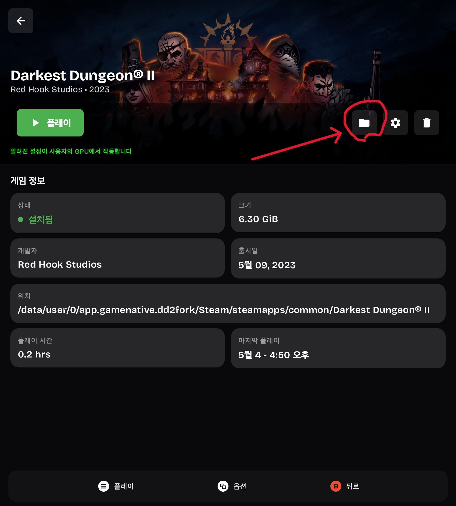
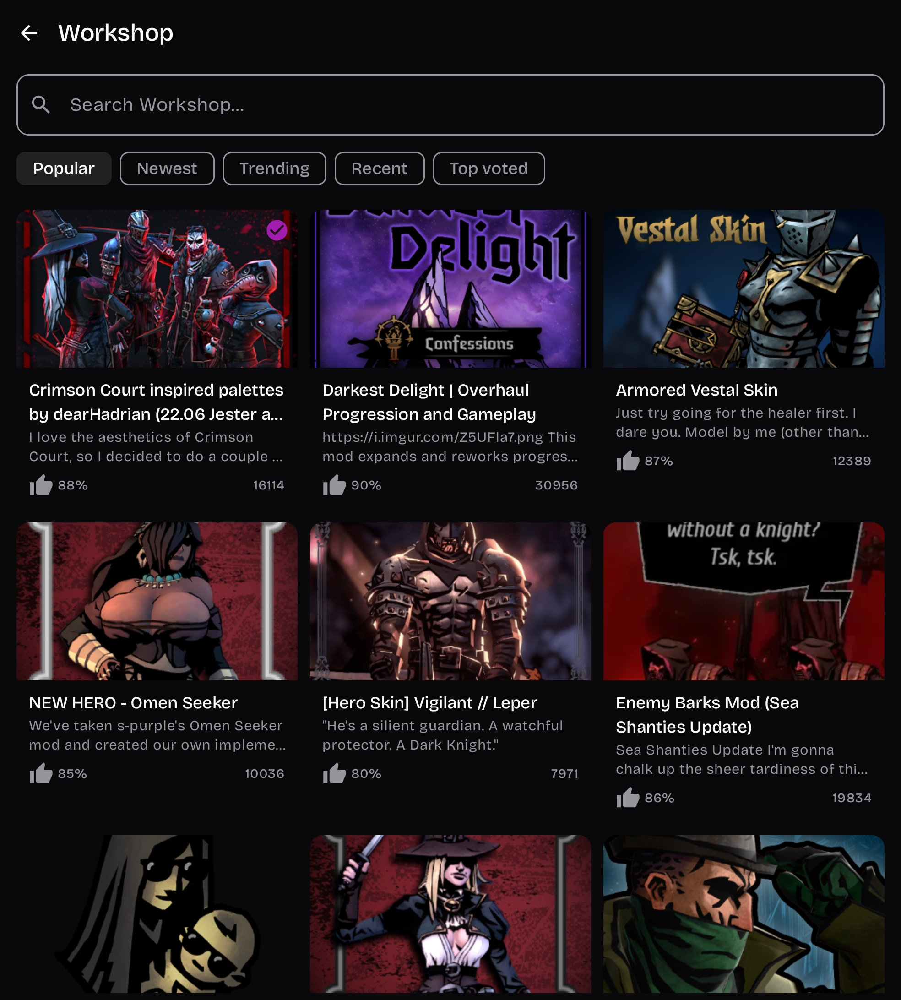
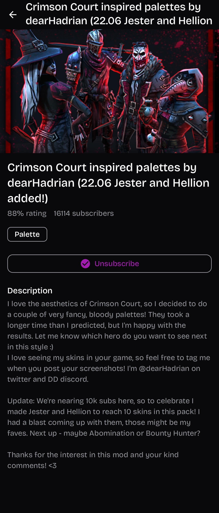
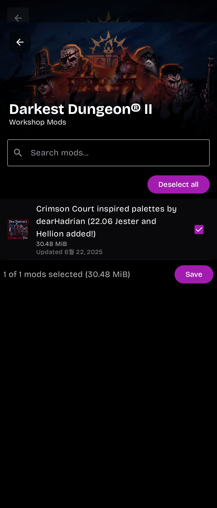

> **This is a feature-proposal fork.** Forked from upstream `utkarshdalal/GameNative` v0.9.0 to prototype an in-app Steam Workshop browser, posted here so the upstream team can decide whether to bring the design back. No fixes or refactors to existing code — only additive surfaces. Discussion + feedback welcome.

---

# [Feature Proposal] In-app Steam Workshop browser (search · details · subscribe) for GameNative

Hi GameNative team — I forked v0.9.0 to prototype an in-app Workshop browsing experience for Darkest Dungeon II (Steam AppID 1940340) and got it working end-to-end on a Galaxy Z Fold 7. Sharing the design + screenshots so you can decide whether it's worth bringing upstream.

## What's missing today

The current `WorkshopManagerDialog` is a **subscription selector**: it lists items the user has already subscribed to via PC Steam and lets them toggle which ones to install in the Wine container. That's great for keeping a Wine install in sync with a desktop account, but a mobile-only user can't *discover* or *subscribe to* a Workshop item from inside the app today. They have to open Steam in a browser, log in, subscribe, then come back into GameNative for the install — friction that defeats the goal of being a self-contained Steam client.

## What this fork adds

A full Workshop browser layered on top of the existing download pipeline. Nothing about `WorkshopManager.kt`'s 3,200+ lines of download/extraction/symlink logic changes — the new code only adds RPC calls and Compose UI. The existing `WorkshopManagerDialog` keeps working unchanged for users who already have a desktop subscription workflow.

### Walkthrough (verified on Galaxy Z Fold 7, real DD2 Workshop)

**1. New entry point on the game detail screen**

A folder icon appears immediately to the left of the existing settings (gear) icon, only for Steam-source games (`appId.startsWith("STEAM_")`). On non-Steam sources it stays hidden, so other game sources are unaffected.



**2. Workshop browser screen**

Tapping the folder opens a browser with a search bar, sort filter chips (Popular / Newest / Trending / Recent / Top voted), and an adaptive grid. Items show thumbnail, title, vote percentage, and subscriber count. Already-subscribed items get a check badge (top-right of the card).



**3. Detail screen with Subscribe / Unsubscribe**

Tapping an item opens its detail view: large preview, title, vote percentage, subscriber count, tags, full description, and a single Subscribe / Unsubscribe button that flips state based on the current subscription. Below it the description renders the same text users see on steamcommunity.com.



**4. Cleanly integrates with the existing `WorkshopManagerDialog`**

Most importantly — when a user subscribes from the new browser, the item shows up in the existing `WorkshopManagerDialog` automatically (next time it's opened), exactly as if they'd subscribed from PC Steam. The user can then toggle whether to install it in the container, hit Save, and the existing pipeline takes over. Nothing about the established workflow changes.



## Implementation

All RPCs go through the existing `SteamClient` session via `SteamUnifiedMessages.createService<PublishedFile>()` — the same handler `WorkshopManager.getSubscribedItems` already uses for `PublishedFile.GetUserFiles`. No Steam Web API key, no `steamcommunity.com` cookies, no protocol-URL routing through the Wine container. The user is already authenticated to Steam; we just call additional methods on the same service.

New PublishedFile RPCs used:
- `QueryFiles` — search/sort/paginate the workshop catalog
- `GetDetails` — fetch one item with full metadata (description, tags, vote data)
- `Subscribe` / `Unsubscribe` — toggle subscription state on the user's account
- `AreFilesInSubscriptionList` — bulk check so the grid can badge already-subscribed items

The post-subscribe sequence reuses the existing flow exactly so the download path doesn't fork:

```
Subscribe RPC succeeds
    ↓
appDao.updateWorkshopState(gameId, true, newIdsCsv)   // same DB column you read from
    ↓
WorkshopManager.startWorkshopDownload(appId, enabledIds, context)   // your existing entry point
```

This is the same three-step sequence in `SteamAppScreen.kt:1262-1283` (the Save handler in `WorkshopManagerDialog`). After that, the existing pipeline (`downloadItems` → `runPostProcessing` → `configureSymlinksForApp`) handles everything: gbe_fork path placement, marker files, post-processing, engine-specific symlink layout. The fork deliberately never calls `downloadItems` directly.

### New files (all additive)

```
app/src/main/java/app/gamenative/workshop/
  WorkshopBrowser.kt                — RPC client (object) — five PublishedFile RPCs
  WorkshopItemDetail.kt             — richer item model + paged result wrapper

app/src/main/java/app/gamenative/ui/model/
  WorkshopBrowserViewModel.kt       — paging, search, sort, subscribe/unsubscribe action

app/src/main/java/app/gamenative/ui/screen/workshop/
  WorkshopBrowserScreen.kt          — search + sort chips (LazyRow) + adaptive grid + infinite scroll
  WorkshopDetailScreen.kt           — hero image, description, tags, Subscribe button
  components/WorkshopItemCard.kt    — grid cell

app/src/main/java/app/gamenative/ui/local/
  LocalWorkshopBrowseEntry.kt       — CompositionLocal so the navigator function reaches
                                       AppScreenContent without prop-drilling six layers
```

### Modified files (small, scoped)

```
ui/screen/PluviaScreen.kt           — two new sealed-data-object destinations
ui/PluviaMain.kt                    — two NavHost composable() blocks; CompositionLocalProvider
                                       around HomeScreen so AppScreenContent gets the navigator
ui/screen/library/LibraryAppScreen.kt — folder ActionIconButton inserted left of the existing
                                       Settings ActionIconButton; rendered only when the
                                       CompositionLocal is provided AND game is from Steam
```

No changes to `WorkshopManager.kt`, `WorkshopManagerDialog.kt`, `SteamService.kt`, the DAO, or any download-pipeline code.

## Verification

Built and installed on a Galaxy Z Fold 7 (SM-F966N, Snapdragon 8 Elite, Adreno 830, Vulkan 1.3.284, Android 16). The fork installs as `app.gamenative.dd2fork` so it sits side-by-side with the upstream-signed v0.9.0 stable rather than fighting its signature — gives the user a fast rollback if anything misbehaves.

End-to-end on DD2 (AppID 1940340):
- Library → DD2 detail screen → folder icon visible left of gear ✅ (screenshot 1)
- Browser opens, real Workshop items load with thumbnails, vote %, and subscriber counts ✅ (screenshot 2)
- Filter chips switch sort correctly (Popular / Newest / Trending / Recent / Top voted) ✅
- LazyRow used for the chips so on a 540 px cover-screen width they scroll horizontally instead of wrapping the longer labels vertically ✅
- Detail screen renders, Subscribe / Unsubscribe button initiates the 3-step flow ✅ (screenshot 3)
- New subscription appears in the existing `WorkshopManagerDialog` ✅ (screenshot 4)
- After Save → existing `startWorkshopDownload` runs → mod downloads and installs into the container exactly like a PC-side subscription
- Existing flow still works unchanged for established users

## Compile-time gotchas worth knowing

When wiring the protobuf builders against `javasteam:1.8.0.1-16-SNAPSHOT`, the field-name casing tripped me up — sharing in case it helps anyone else doing similar work:
- `addAllRequiredtags` (lowercase `t`), not `addAllRequiredTags`
- `setListtype` on `CPublishedFile_AreFilesInSubscriptionList_Request` (lowercase `t`); but `setListType` (CamelCase) on `Subscribe`/`Unsubscribe` — Steam's own inconsistency carried through
- Response of `AreFilesInSubscriptionList` uses `getFilesList()` returning `InList` entries, not `getInListList()`
- Each `InList` entry: `getPublishedfileid()` (lowercase) and `getInlist()`, not the camelCase variants
- `voteData.votesUp/votesDown` are `int`, so they need `.toLong()` when stored in `Long` fields

## Open items

- Strings are currently English-only in the new screens; adding `values-*/strings.xml` entries for the existing locales (es/da/pt-rBR/zh-rTW/zh-rCN/fr/de/uk/it/ro/pl/ru/ko) is straightforward.
- Creator display name is shown as a SteamID64 today; resolving to a username via `ISteamUser.GetPlayerSummaries` would be a nice follow-up.
- An "already subscribed" filter on the browser grid would be useful but isn't in this revision.
- 30-minute thermal/FPS measurement on Fold 7 is pending; smoke testing was on a charging session (function verification, not thermal envelope).

## Target use case

The motivating use case is mobile-only DD2 players (and similar communities) who don't have a desktop Steam install handy to subscribe from. But the feature is game-agnostic — every Steam Workshop-enabled title benefits from it. Especially relevant where Workshop items are central to the game (Skyrim, Cities: Skylines, Source mods, modded co-op shooters).

Happy to PR upstream if this direction looks reasonable, or to keep iterating in the fork. Feedback very welcome.

---

**Fork:** https://github.com/iunius612/GameNative — branch `feature/workshop-browser`
**Base:** GameNative `v0.9.0` (sha `24508c2a`)
